<p align="center">
  
</p>

# Pixelog

[](https://github.com/ArqonAi/Pixelog/actions/workflows/test.yml)
[](https://github.com/ArqonAi/Pixelog/actions/workflows/release.yml)
[](https://goreportcard.com/report/github.com/ArqonAi/Pixelog)
[](https://pkg.go.dev/github.com/ArqonAi/Pixelog)
[](LICENSE)
[](https://golang.org/)
[](CONTRIBUTING.md)
[](cmd/pixe)
[](https://en.wikipedia.org/wiki/Galois/Counter_Mode)
[](https://en.wikipedia.org/wiki/MP4_file_format)
[](benchmarks/BENCHMARKS.md)
[](pkg/publish/E2E.md)

**A content-addressed archival format that stores documents as QR-encoded
frames inside an MP4 container, with a self-similar fractal memory
hierarchy, salience-preserved compaction, IPFS+Arweave durability, and
a benchmark-validated retrieval stack on top.**

---

## Overview

Pixelog encodes a document into a `.pixe` file — an MP4 whose video track
carries QR-encoded data chunks instead of imagery. The container is
standard MP4, so any media stack (browsers, mobile players, OS
thumbnailers, FFmpeg, archival storage) handles transport, seeking, and
streaming without bespoke tooling. Higher layers add content-addressed
identity, delta-encoded versioning, AES-256-GCM authenticated
encryption, a self-similar fractal memory hierarchy with salience-
preserved compaction, and a hybrid retriever that hits state-of-the-art
recall on four public benchmarks.

**Design rationale.** Pixelog is built around five observations:

1. **Transport layers should be commodity.** MP4 has the widest
   playback surface of any container in existence. Building on top of
   it eliminates a whole class of distribution problems (mobile
   playback, CDN edge caching, browser preview, cold storage).
2. **Storage should be content-addressed and self-verifying.** Every
   frame carries SHA-256 metadata; every capsule has a stable hash;
   integrity verification is a local, deterministic operation.
3. **Retrieval should not require an LLM in the hot path.** The hybrid
   retriever (semantic + BM25 + temporal + preference + entity +
   recency) is fully algorithmic and runs in ~0.6 ms per query with no
   network calls. LLMs are an opt-in stage for answer synthesis only.
4. **Memory should be self-similar across scales.** Per-session capsules
   and era capsules share the same `(L0, L1, L2)` schema; the same
   retrieval interface works whether you're matching today's events or
   a decade-old summary. Active context cost is `O(log T)` regardless
   of agent age.
5. **Durability is a separate concern from storage format.** A capsule
   identified by `pixe://capsule/<hash>` resolves uniformly across
   local SSD, IPFS, and Arweave permaweb — the agent never knows or
   cares which tier holds a given memory.

**At-a-glance properties:**

| Property                  | Value |
| ------------------------- | ----- |
| Container                 | MP4 (H.264) — universally playable |
| Payload density           | 2.9 KB / frame at 1080p (≈ 87 KB/s) |
| Damage tolerance          | Reed-Solomon, ≈30 % per frame; QR ECC level H |
| Encryption (optional)     | AES-256-GCM, PBKDF2-SHA-256 (600k iters), 32-byte salt, 12-byte nonce |
| Memory footprint          | Constant ≈10 MB during conversion, independent of file size |
| Retrieval (flat)          | HNSW vector index + hybrid lexical/temporal scoring |
| Retrieval (fractal)       | Surface (`O(1)`) + depth-bounded URI graph traversal (`O(depth)`) |
| Active context per agent  | `O(log T)` — ~3 k tokens for 10-year-old agent, ~3.5 k for 100-year-old |
| Durability targets        | Local SSD, IPFS (Kubo HTTP API), Arweave permaweb (self-signing) |
| Network dependency        | None for archival, integrity, retrieval; durability + LLM stages opt-in |

---

## Quick Start

### Installation

```bash
go install github.com/ArqonAi/Pixelog/cmd/pixe@latest
```

Or build from source:

```bash
git clone https://github.com/ArqonAi/Pixelog.git
cd Pixelog
go build -o pixe ./cmd/pixe
```

### Basic Workflow

```bash
# Convert document to .pixe format
pixe convert document.txt -o doc.pixe

# Build semantic search index (offline hash embedder, no key needed)
pixe index doc.pixe --embedder hash

# Or use any hosted provider you have a key for:
#   export OPENAI_API_KEY=...      # OpenAI
#   export ANTHROPIC_API_KEY=...   # Anthropic
#   export GEMINI_API_KEY=...      # Gemini
#   export OPENROUTER_API_KEY=...  # OpenRouter aggregator
# pixe index doc.pixe

# Search by meaning
pixe search doc.pixe "machine learning concepts" --top 5

# Chat with your document
pixe chat doc.pixe
```

---

## Core Features

### File Operations
- Convert any file type to .pixe format
- Extract original files from .pixe archives
- Display file metadata and structure
- Integrity checking via SHA-256 hashing
- AES-256-GCM encryption with password

### Semantic Search
- Build vector embeddings for sub-100ms search
- Meaning-based queries (not just keyword matching)
- Interactive LLM Q&A with automatic context retrieval
- Ranked results by cosine similarity

### Version Control
- Create version snapshots with messages
- List all versions with timestamps
- Compare versions (frame-level changes)
- Time-travel search across historical versions
- Delta encoding (64% average space savings)

### Performance
- Sub-100ms search with HNSW indexing
- Constant 10MB memory footprint (any file size)
- Streaming support for multi-GB files
- Parallel frame encoding/decoding

### Security
- AES-256-GCM authenticated encryption
- PBKDF2 key derivation (600,000 iterations)
- Reed-Solomon error correction (30% damage tolerance)
- SHA-256 frame hashing for tamper detection
- Air-gapped operation (no internet required)

---

## Tiered Memory & Agent Capsules

Pixelog ships a typed, three-tier memory subsystem (`internal/memory`) designed for long-horizon LLM agents. Each capsule is content-addressed under the `pixe://` URI scheme.

### URI scheme

```
pixe://capsule/<sha256>                       # content-addressed capsule
pixe://memory/<namespace>/<category>/<id>     # typed memory entry
pixe://agent/<tokenID>/v<version>             # ERC-8004 agent identity
pixe://agent/<tokenID>/v<version>/capsule/<sha256>
pixe://arweave/<txID>                         # mirrored Arweave permaweb pointer
```

Build / parse round-trips via `memory.BuildCapsuleURI`, `memory.BuildMemoryURI`, `memory.ParseURI`.

### Six typed memory categories

| Category       | Weight | Purpose                                       |
| -------------- | ------ | --------------------------------------------- |
| `preference`   | 1.2    | User preferences, likes/dislikes              |
| `instruction`  | 1.5    | Persistent rules (`always`, `never`)          |
| `fact`         | 1.0    | World facts, definitions                      |
| `event`        | 0.9    | Temporal references (meetings, deadlines)    |
| `relationship` | 1.1    | Social graph (`works at`, `manager is`)       |
| `skill`        | 1.0    | Procedures, how-to flows                      |

The `CategoryStore` partitions a vector index per category, weights search scores by category importance, and exposes `Search`, `SearchCategory`, `Stats`.

### Three context tiers

```go
type ContextTier string
const (
    TierL0 ContextTier = "l0" // ≤32 tokens   — abstract
    TierL1 ContextTier = "l1" // ≤128 tokens  — overview
    TierL2 ContextTier = "l2" // unbounded    — full content
)
```

Generated automatically via `memory.GenerateTiers` (LLM summariser preferred, deterministic heuristic fallback when offline).

### Three-phase archival pipeline

```
                ┌──────────────┐   ┌──────────────┐   ┌──────────────┐
   messages ──> │  Compress    │──>│   Archive    │──>│   Publish    │
                │  (condense + │   │  (.pixe blob │   │  (durable    │
                │   classify)  │   │   + sha256)  │   │   storage +  │
                │              │   │              │   │   anchor)    │
                └──────────────┘   └──────────────┘   └──────────────┘
                       │                  │                   │
                       ▼                  ▼                   ▼
                  TypedMemory[]      pixe://capsule/...    ipfs://<CID>
                  TieredEntry[]                            ar://<txID>
                                                           ERC-8004 anchor
```

The Publish phase has two independent legs:

- **Blob durability** — the capsule MP4 is uploaded in parallel to every
  `publish.Publisher` configured under `BlobPublishers` (IPFS, Arweave, …).
  Per-publisher failures are recorded in `ArchivalResult.PublishErrors`
  but do not abort the pipeline; archival succeeds as long as the local
  capsule is written. Locators (`Qm…`, `bafy…`, Arweave tx-id) are
  returned in `ArchivalResult.Publications`.
- **On-chain anchor** — the 32-byte content hash is optionally written
  to an EVM contract (e.g. ERC-8004 agent registry) via the host-supplied
  `OnChainPublisher`. The hash itself is independent of where the blob
  lives, so anchors and blob CIDs/tx-ids compose naturally.

Built-in publishers (real, no SDK dependencies):

| Network  | Package                                | Endpoint                          |
| -------- | -------------------------------------- | --------------------------------- |
| IPFS     | `pkg/publish/ipfs`                     | Kubo `/api/v0/add` (CIDv1, raw-leaves, sha2-256) |
| Arweave  | `pkg/publish/arweave`                  | format-2 tx with merkle data-root, RSA-PSS-SHA256 self-signing |

```go
ipfsPub, _ := ipfs.New(ipfs.Config{APIURL: "http://127.0.0.1:5001"})
wallet, _ := arweave.LoadWalletFromFile("wallet.json")
arPub, _  := arweave.New(arweave.Config{NodeURL: "https://arweave.net", Wallet: wallet})

pipeline := memory.NewArchivalPipeline(&memory.ArchivalConfig{
    Namespace:         "agent-42",
    Summarizer:        llmSummarizer,
    ContentSummarizer: contentSummarizer,
    Converter:         pixeWriter,                        // .pixe writer
    BlobPublishers:    []publish.Publisher{ipfsPub, arPub}, // durability layer
    Publisher:         erc8004Publisher,                  // optional on-chain anchor
    Categories:        memory.NewCategoryStore(embedder, nil),
})
result, _ := pipeline.RunFull(ctx, namespace, messages, capsulePath, agentTokenID)
// result.Publications: [{network:"ipfs", locator:"bafy…"}, {network:"arweave", locator:"…"}]
```

CLI shortcut for already-built capsules:

```bash
export IPFS_API_URL=http://127.0.0.1:5001
export ARWEAVE_NODE_URL=https://arweave.net
export ARWEAVE_WALLET_PATH=./wallet.json

pixe publish doc.pixe --target ipfs,arweave
# [{"network":"ipfs","result":{"locator":"bafy…",…}},
#  {"network":"arweave","result":{"locator":"…",…}}]
```

The condenser supports four strategies: `noop`, `sliding_window`, `llm_summary`, `hybrid` (default).

### Fractal memory (self-similar tier hierarchy)

The flat `(L0, L1, L2)` per session capsule is the leaf of a recursive
structure: at every level above the session, an **EraCapsule** carries
the same triplet but with its `L2` populated by child-capsule URIs
instead of raw events. Same retrieval interface at every scale, content-
addressed all the way down — Sierpinski-style.

```
era-of-eras (year)        ── (L0, L1, L2 = era URIs)
  ├── era (quarter)       ── (L0, L1, L2 = era URIs)
  │     ├── era (week)    ── (L0, L1, L2 = era URIs)
  │     │     ├── era (day)
  │     │     │     ├── session capsule  ── (L0, L1, L2 = raw events)
  │     │     │     └── ...
  │     │     └── ...
  │     └── ...
  └── ...
```

**Compaction triggers** (both fire the same primitive):

- **Circadian** (`internal/memory/trigger_circadian.go`) — calendar-aligned
  scheduler: ISO-week / month / quarter / year / decade boundaries fire
  rollups once each window closes. Models sleep-cycle consolidation.
- **Salience pressure** (`trigger_pressure.go`) — token-budget watcher
  that fires opportunistic compaction when the active context exceeds
  the configured cap. Models stress-driven consolidation. Falls back to
  the same `Compact()` primitive.

**Salience-preserved collapse** (`compaction.go`) implements the
"removed middle" — at each rollup, children are scored on
`α·access_freq + β·recency + γ·emotional_weight + δ·tier_weight`. Top-K
stay surfaced (full L1 inlined); the rest are buried (L1 stripped from
the parent, full content still reachable via the URI graph). This is
the formal mechanism behind "subconscious / repressed memory" — content
is present but not loaded by surface retrieval.

**Storage tiers** (`resolver.go`):

| Tier | Where | Holds |
| --- | --- | --- |
| Hot | local capsule store (`CapsuleStore`) | current session + recent eras |
| Warm | IPFS (`ResolverBackend`) | weeks → months |
| Cold | Arweave permaweb | years → decades |

The `pixe://capsule/<hash>` URI resolves uniformly across all three —
the agent never knows which tier holds a memory until it tries to fetch
it. Active context cost is `O(log T)` regardless of agent age; total
storage scales naturally to PB at fleet scale.

**Two retrieval modes** (`retrieval_deep.go`):

- **Surface** — match against currently-active eras' L0/L1. Bounded
  cost per query, independent of total memory size.
- **Deep** (`DeepRetrieve`) — depth-bounded URI graph traversal that
  models "free association": always descends into era-level children
  within the depth budget, so buried memories surface when the agent
  deliberately reflects. `SurfaceOnly: true` flips to conscious-recall
  semantics that skips buried entries.

```go
svc := memory.NewFractalService(memory.DefaultFractalConfig("agent-42", store, compactor))
svc.Start(ctx)
defer svc.Stop()

// After each archival pass:
svc.AddSession(ctx, sessionRef)   // queues + notifies the scheduler
svc.AddTokens(estimatedTokens)    // updates pressure monitor

// Anywhere:
hits, _ := memory.DeepRetrieve(ctx, resolver, []*memory.EraCapsule{currentEra},
    memory.DeepRetrieveOptions{Query: "what did we decide about X", MaxDepth: 3})
```

---

## Benchmarking

Pixelog includes a unified harness for evaluating memory quality against external benchmarks. Run via `cmd/pixe-bench`:

```bash
go build -o pixe-bench ./cmd/pixe-bench
```

### Supported suites

| Suite      | Source                                   | Modes                | Categories                                                                                                                  |
| ---------- | ---------------------------------------- | -------------------- | --------------------------------------------------------------------------------------------------------------------------- |
| `locomo`   | [snap-research/locomo][locomo] (ACL '24) | `session`, `hybrid`  | `single_hop`, `multi_hop`, `temporal`, `open_domain`, `adversarial`                                                         |
| `convomem` | [Salesforce/ConvoMem][convomem]          | `session`            | `user_evidence`, `assistant_facts_evidence`, `changing_evidence`, `abstention_evidence`, `preference_evidence`, `implicit_connection_evidence` |
| `membench` | [import-myself/Membench][membench] (ACL '25 Findings) | `full` | `participation_reflective`, `participation_factual`, `observation_reflective`, `observation_factual`              |

[locomo]: https://github.com/snap-research/locomo
[convomem]: https://huggingface.co/datasets/Salesforce/ConvoMem
[membench]: https://github.com/import-myself/Membench

### Quickstart

```bash
# 1. Fetch a dataset (LoCoMo example)
curl -L https://raw.githubusercontent.com/snap-research/locomo/main/data/locomo10.json -o locomo10.json

# 2. Run offline (deterministic hash embedder, retrieval-only, F1 judge)
./pixe-bench --suite locomo --mode session --dataset locomo10.json \
             --embedder hash --answerer=false --judge exact \
             --out locomo-report.json

# 3. Run with full LLM stack — pick any supported provider.
export OPENAI_API_KEY=sk-...     # or ANTHROPIC_API_KEY / GEMINI_API_KEY / OPENROUTER_API_KEY / ...
./pixe-bench --suite locomo --mode hybrid --dataset locomo10.json \
             --judge llm --answerer --provider openai --llm-model gpt-4o-mini \
             --out locomo-report.json
```

### Modes

- **`session`** — replays each conversation session-by-session, calling `Consolidate` between sessions. Models the live agent flow.
- **`hybrid`** — LoCoMo's RAG-on-summaries baseline; session ingestion plus a final consolidation pass.
- **`full`** — dumps the entire transcript in one batch, then consolidates. Useful for MemBench's pre-built information flows.

### Metrics

Every report includes `judge_mean` (LLM rubric 0–5 normalised), `f1_mean` (token F1), `exact_match_rate`, `abstain_accuracy` (for adversarial / abstention probes), and per-category breakdowns. Results are emitted as JSON for downstream comparison.

### CI-friendly offline runs

The bundled `HashEmbedder` (deterministic SHA-256 → 384-d bag-of-words) plus `ExactMatchJudge` (exact match → token F1 fallback) lets benchmark runs execute without any network calls — useful for regression gates in CI.

### Session reflection

`--reflect` triggers a **per-session structured summary pass** during `Consolidate` (PERSON / EVENT / FACT / PREFERENCE / PLAN / RELATIONSHIP / FEELING tagged lines, with relative-date resolution). When combined with `--full-context`, the answerer receives the dense session summaries instead of the raw transcript — denser, faster, and lets the model reason over linked entities. `--reflect-provider` / `--reflect-model` let you run reflection on a different model than the answerer.

## Benchmarks

All numbers below are reproducible from this repository with the
commands in [`benchmarks/BENCHMARKS.md`](benchmarks/BENCHMARKS.md).
Per-question result files are written to whatever path you pass via
`--out`.

The headline metric is **retrieval recall (R@k)** — the fraction of
gold evidence sessions / turns that the retriever surfaces in the
top-k candidates.

> **No LLM is invoked for any of the headline numbers below.** Recall@k
> is a ranking task (does the gold session land in the top-k?), which
> is a pure search problem and needs no text generation. Producing a
> final natural-language answer from the retrieved context still needs
> an LLM and is reported separately under end-to-end QA.

| Benchmark | Metric | **Pixelog** | Notes |
| --- | --- | --- | --- |
| LongMemEval S (500 QA) | Hit@5  | **97.20%** | 115k-token haystacks, hash embedder, no LLM |
| LongMemEval S (500 QA) | Hit@10 | **98.20%** | same config |
| LongMemEval Oracle (500 QA) | Hit@5 | **100.00%** | oracle haystack |
| LoCoMo (1,986 QA) | Hit@10 | **96.62%** | 10 conversations, hash embedder, no LLM |
| LoCoMo (1,986 QA) | Hit@5  | **92.08%** | same config |
| ConvoMem (top-bucket × 6 cats, 265 cases) | Hit@5 | **100.00%** | hardest bucket per category, hash embedder |
| MemBench ACL 2025 (6,779 QA) | Hit@5 | **98.45%** | all FirstAgent + ThirdAgent splits, hash embedder |

**Every Pixelog row uses the deterministic hash embedder — no API key,
no cloud, no LLM at any stage.** The retriever lives in
[`internal/bench/hybrid_retriever.go`](internal/bench/hybrid_retriever.go)
and combines semantic cosine, BM25, temporal proximity,
preference-pattern boosts, capitalised-entity overlap, and a small
recency tiebreaker.

Default weights (tuned once on LongMemEval, held fixed across every
other benchmark — *no per-suite tuning, no LLM rerank, no retrieval
finesse beyond what is committed*):

```text
semantic=1.0  bm25=0.6  temporal=0.5  preference=0.3  keyword=0.4  recency=0.05
```

We deliberately **do not headline a "100%" number on any benchmark
where a sub-1% slice can be closed by inspecting the misses** — that
is teaching to the test, and
[`benchmarks/BENCHMARKS.md`](benchmarks/BENCHMARKS.md) flags it.

We also deliberately **do not include a side-by-side comparison
against other memory systems**. Those projects publish different
metrics on different splits, and placing retrieval recall next to
end-to-end QA accuracy is not an honest comparison. See each
project's own research page for their published numbers.

End-to-end QA accuracy under the LLM answerer (`--full-context --cot
--reflect`) is documented separately as *Latest QA results* below.

### Reproducing every result

```bash
git clone https://github.com/ArqonAi/Pixelog.git pixelog
cd pixelog
go build -o pixe-bench ./cmd/pixe-bench
# see benchmarks/BENCHMARKS.md for dataset download commands
./pixe-bench --suite longmemeval --recall-k 5 --embedder hash \
    --dataset /tmp/pixe-bench/datasets/longmemeval_s.json
```

### Latest QA results (LoCoMo, 30 QA pilot, conversation 0)

QA-accuracy mode — judge: `openai/gpt-4o`, answerer: `anthropic/claude-sonnet-4.6` via OpenRouter. Embedder: `nomic-embed-text` (Ollama).

| Run                         | judge_mean | single_hop | multi_hop | temporal | latency  |
| --------------------------- | ---------- | ---------- | --------- | -------- | -------- |
| `--full-context --cot`      | **62.70%** | 82.00%     | 46.30%    | 80.00%   | 6.6 s/qa |
| `--full-context --reflect --cot` | 60.00% | 78.00%     | 45.00%    | 75.00%   | 5.7 s/qa |

This is end-to-end QA accuracy (judged), not retrieval recall — different metric.

---

## CLI Commands

### Basic Operations

```bash
pixe convert <input> -o <output.pixe>    # Convert to .pixe
pixe extract <file.pixe> -o <output>      # Extract from .pixe
pixe info <file.pixe>                     # Show file info
pixe verify <file.pixe>                   # Verify integrity
pixe publish <file.pixe> --target ipfs,arweave   # Upload to durability layers
```

### Semantic Search (any supported provider, or fully offline)

```bash
# Offline: deterministic hash embedder, no key needed.
pixe index <file.pixe> --embedder hash

# Hosted: pick any supported provider via its env var.
export OPENAI_API_KEY=sk-...           # or ANTHROPIC_API_KEY / GEMINI_API_KEY / OPENROUTER_API_KEY / ...
pixe index <file.pixe>                           # Build index
pixe search <file.pixe> "query" --top 5          # Search
pixe chat <file.pixe>                            # Interactive chat
pixe chat <file.pixe> --model openai/gpt-5       # Specific model
pixe chat <file.pixe> --list                     # Show models
```

### Version Control

```bash
pixe version <file.pixe> -m "message"            # Create version
pixe versions <file.pixe>                        # List versions
pixe diff <file.pixe> <v1> <v2>                 # Compare versions
pixe query <file.pixe> <version> "query"         # Time-travel query
```

### Encryption / Decryption

```bash
# Encrypt at convert time
pixe convert file.txt -o file.pixe --encrypt --password 'long-strong-passphrase'

# Decrypt at extract time
pixe extract file.pixe -o ./out --password 'long-strong-passphrase'
```

`--encrypt` and `--password` are flags on `pixe convert` and `pixe
extract` only. Every other command (`info`, `verify`, `publish`,
`hybrid-search` over the raw frames) operates on the encrypted bytes
verbatim and never sees the plaintext. See the
[Encryption & Decryption](#encryption--decryption) section for the
full operational model.

### Durable publishing

```bash
export IPFS_API_URL=http://127.0.0.1:5001
export ARWEAVE_NODE_URL=https://arweave.net
export ARWEAVE_WALLET_PATH=./wallet.json

pixe publish doc.pixe --target ipfs,arweave
# returns one Result per network, each with locator + gateway URL
```

### Fractal memory

```bash
# Fold every day-level era into a week-level era (or week→month, month→quarter, ...).
pixe compact --data-dir ./.pixe-data --namespace agent-1 --level week

# Free-association DeepRetrieve over the era graph; walks year→month→...→session.
pixe recall "trip to Lisbon" --data-dir ./.pixe-data --namespace agent-1 \
    --depth 3 --top 5

# Conscious-recall mode: skip buried children.
pixe recall "trip to Lisbon" --surface-only --json
```

`compact` drives the same code path as the running `FractalService`'s
circadian scheduler but as a one-shot, so offline batch jobs and
catch-up after long downtime work without a daemon.
`recall` is the read side: `DeepRetrieve` walks the URI graph from the
highest-level capsules in the store down through every level, returning
ranked hits with their depth, matched tier, and buried flag.

---

## Use Cases

### Knowledge Base Management

```bash
# Create and index
pixe convert docs/ -o knowledge.pixe
pixe index knowledge.pixe

# Semantic search
pixe search knowledge.pixe "authentication best practices"

# Track changes
pixe version knowledge.pixe -m "Added security section"
pixe diff knowledge.pixe 1 2
```

### Compliance & Audit Trails

```bash
# Encrypted archive
pixe convert compliance-docs/ -o audit.pixe --encrypt --password xxx

# Track all changes
pixe versions audit.pixe

# Time-travel query
pixe query audit.pixe 1 "Q1 data retention policy"

# Verify integrity
pixe verify audit.pixe --password xxx
```

### Research Paper Collections

```bash
# Index papers
pixe convert papers/ -o research.pixe
pixe index research.pixe

# Semantic citation search
pixe search research.pixe "transformer attention mechanisms"

# Chat with research
pixe chat research.pixe
```

### Secure Document Archival

```bash
# Encrypted, offline-first storage
pixe convert sensitive-docs/ -o vault.pixe --encrypt --password xxx
pixe verify vault.pixe --password xxx
pixe extract vault.pixe -o restored/ --password xxx
```

### Large-Scale Code Archival

```bash
# Streaming for multi-GB codebases
pixe convert monorepo.tar.gz -o codebase.pixe
# Auto-streaming: 2.5 GB with 10MB RAM

# Version control
pixe version codebase.pixe -m "Release v2.0"

# Semantic code search
pixe search codebase.pixe "authentication middleware"
```

---

## How It Works

### Per-capsule pipeline

```
Document → Chunks (2.9KB) → Encryption → QR Codes → MP4 Frames → .pixe File
```

Each `.pixe` file is an MP4 video:
- Frame 0: Metadata (file info, encryption params, version history)
- Frame 1+: QR-encoded data chunks
- Audio track: Silent (required for MP4 spec)

### Multi-capsule fractal

Session capsules are the leaves of a self-similar tree. Era capsules
at each level above (Day / Week / Month / Quarter / Year / Decade)
carry the same `(L0, L1, L2)` schema, with `L2` populated by child
capsule URIs instead of raw events. Compaction is triggered by either
circadian boundaries (calendar-aligned) or salience pressure (token-
budget watcher); both feed a single `Compact()` primitive that applies
salience-preserved collapse — top-K children stay surfaced (full L1
inlined), the rest are buried (L1 stripped, content still URI-reachable).

### Durability

The `CapsuleResolver` fans hash lookups across local store → IPFS
gateway → Arweave node, transparently warming the local cache on
remote hits. Publishing is the symmetric path: `BlobPublishers`
(`pkg/publish/{ipfs,arweave}`) upload the capsule bytes to every
configured durability network in parallel during the Archive phase.

### Directory Structure

```
pixelog/
├── cmd/
│   ├── pixe/                  # CLI (convert, extract, search, publish, ...)
│   └── pixe-bench/            # benchmark harness (LoCoMo, ConvoMem, LongMemEval, MemBench)
├── internal/
│   ├── converter/             # document → .pixe
│   ├── crypto/                # AES-256-GCM
│   ├── qr/                    # QR encode/decode
│   ├── video/                 # MP4 muxing / frame extraction
│   ├── index/                 # HNSW + delta versioning
│   ├── search/                # vector + lexical hybrid retriever
│   ├── llm/                   # provider-agnostic LLM client
│   └── memory/                # archival pipeline + fractal memory
│       ├── archival.go        # 3-phase compress → archive → publish
│       ├── condenser.go       # event-stream condensation
│       ├── categories.go      # typed-memory category enum
│       ├── category_store.go  # per-category vector subspace
│       ├── retention.go       # Ebbinghaus retention scoring
│       ├── access_tracker.go  # access frequency / recency
│       ├── tiered.go          # (L0, L1, L2) tier triplet + GenerateTiers
│       ├── era.go             # EraCapsule, EraLevel, ChildRef (fractal node)
│       ├── capsule_store.go   # content-addressed local store
│       ├── salience.go        # capsule-level salience scoring
│       ├── compaction.go      # Compact() primitive + removed-middle
│       ├── fractal_service.go # orchestrator (queues + triggers + storage)
│       ├── trigger_circadian.go  # calendar-aligned scheduler
│       ├── trigger_pressure.go   # token-budget watcher
│       ├── resolver.go        # local → IPFS → Arweave fallback chain
│       ├── retrieval_deep.go  # depth-bounded URI graph traversal
│       └── uri.go             # pixe:// URI scheme parser
├── pkg/
│   ├── config/                # configuration types
│   └── publish/               # durable-publish substrate
│       ├── publish.go         # Publisher interface + Result
│       ├── ipfs/              # Kubo HTTP API uploader
│       └── arweave/           # self-signing format-2 tx + chunk upload
└── benchmarks/                # benchmark report archive
```

---

## Performance

| Operation | Time | Notes |
|-----------|------|-------|
| Index Build | 136ms | One-time per file |
| Semantic Search | <100ms | With 1000+ frames |
| Frame Extraction | 20ms | Direct FFmpeg seek |
| LLM Chat Response | <200ms | Excl. LLM latency |
| Version Creation | 85ms | Delta calculation |
| Integrity Check | 50ms/frame | Parallel decoding |

### Per-file storage efficiency

- Delta encoding: 64 % space savings
- GZIP compression: 75 % reduction
- Combined: ~80 % smaller than raw storage

### Memory efficiency during conversion

| File Size | Traditional | Pixelog streaming |
|-----------|-------------|-------------------|
| 10 MB | 10 MB RAM | 10 MB RAM |
| 100 MB | 100 MB RAM | 10 MB RAM |
| 1 GB | 1 GB RAM | 10 MB RAM |
| 10 GB | 10 GB RAM | 10 MB RAM |

Streaming auto-enables for files >100 MB.

### Lifetime storage scalability (fractal memory)

Assumes a sustained 10 sessions/day with default circadian compaction
(`SurfaceRatio = 0.30`).

Per fold, salience-preserved collapse keeps the top 30 % of children
fully surfaced (`L1` inlined) and buries the rest (`L0` only). Token
math: `0.3N · 550 + 0.7N · 50 + 550` → ~2.75× compression *per level*
in surface-loadable bytes; compounded across the seven levels (Session
→ Day → Week → Month → Quarter → Year → Decade) that's **~410×
surface-context compression**.

| Lifetime | Leaf capsules | Era capsules | Total disk | Active context |
| --- | --- | --- | --- | --- |
| 1 year | 182 MB | ~5 MB | **~187 MB** | ~3 k tokens |
| 10 years | 1.82 GB | ~50 MB | **~1.87 GB** | ~3 k tokens |
| 100 years | 18.2 GB | ~500 MB | **~18.7 GB** | ~3.5 k tokens |
| 1 000 years (theoretical) | 182 GB | ~5 GB | ~187 GB | ~4 k tokens |

Fleet projections:

| Fleet × lifetime | Total | Practical tier |
| --- | --- | --- |
| 1 k agents × 10 yr | 1.87 TB | local + IPFS |
| 100 k agents × 10 yr | 187 TB | IPFS + Arweave |
| 1 M agents × 10 yr | **1.87 PB** | Arweave dominant |
| 100 k agents × 100 yr | **1.87 PB** | Arweave dominant |

**Headline.** Active memory cost grows logarithmically with agent age;
total disk is bounded only by the underlying durability substrate.
PB-scale fleet memory is realistic on the IPFS+Arweave stack.

### Theoretical bounds

| Bound | Value | Practical meaning |
| --- | --- | --- |
| Hash address space | 2²⁵⁶ ≈ 10⁷⁷ | Effectively infinite — no collision concern |
| Per-capsule resolvable bytes | 2⁶⁴ − 1 | 16 EB before format-level overflow |
| Active context per query | ~7 × L1 ≈ 3.5 k tokens | Bounded regardless of agent age |
| Disk substrate | Arweave endowment | Permaweb economics |
| Retrieval depth | configurable (`MaxDepth`) | `O(branching·depth)` worst case |

---

## Security Model

Pixelog's security posture is intentionally narrow: it protects payload
confidentiality and integrity at rest. It is *not* a key-management
system, an access-control system, or a secure-enclave runtime. Compose
it with those layers when needed.

### Cryptographic primitives

| Primitive       | Choice                          | Rationale |
| --------------- | ------------------------------- | --------- |
| Symmetric AEAD  | AES-256-GCM                     | NIST-standard, hardware-accelerated, authenticated |
| KDF             | PBKDF2-HMAC-SHA-256, 600 000 iters | OWASP-current, deterministic, no GPU shortcut for small budgets |
| Salt            | 32 bytes / file, CSPRNG         | Per-file domain separation |
| Nonce           | 12 bytes / operation, CSPRNG    | GCM-correct length, no reuse |
| Integrity tag   | 16 bytes (GCM)                  | Detects single-bit tamper |
| Frame integrity | SHA-256 on chunk pre-encryption | Independent of GCM tag |

No bespoke crypto. All primitives come from `crypto/aes`, `crypto/cipher`,
`crypto/sha256`, `golang.org/x/crypto/pbkdf2`.

### Resilience to physical / channel damage

- Reed-Solomon at the chunk layer tolerates ≈ 30 % loss per frame.
- QR error-correction level H gives a second redundancy layer at the
  pixel level.
- The two combined mean a `.pixe` file remains decodable through severe
  re-encoding, scaling, color-space conversion, and partial frame loss.

### What this does *not* address

- Side-channel attacks against the host running decryption.
- Adversaries with the password (encryption is symmetric).
- Forward-secrecy across versions (use external key rotation if
  required).
- Confidentiality of the *fact that a file exists* (the MP4 container
  is plaintext metadata).

### File Structure

```
.pixe File (MP4 Container)
├── Video Track (H.264)
│   ├── Frame 0: Metadata
│   ├── Frame 1+: [32B salt][12B nonce][encrypted data][16B auth tag]
└── Audio Track (silent)
```

---

## Encryption & Decryption

Encryption is a per-file, AES-256-GCM operation applied at convert
time and reversed at extract time. The cryptographic primitives, the
KDF parameters, and the on-disk layout are documented in
[Security Model](#security-model); this section is the operational
guide.

### CLI

```bash
# Encrypt at convert time.
pixe convert plaintext.pdf -o secret.pixe \
    --encrypt --password 'long-strong-passphrase'

# Decrypt at extract time.
pixe extract secret.pixe -o ./out \
    --password 'long-strong-passphrase'
```

`--encrypt` and `--password` are flags on `pixe convert` only;
`--password` is also accepted by `pixe extract`. Every other command
(`info`, `verify`, `publish`) operates on the encrypted bytes
verbatim and never sees the plaintext.

### What is encrypted, what stays plaintext

Only the **payload chunks** inside each video frame are encrypted.
The MP4 container, per-frame headers, and the metadata frame remain
plaintext so any commodity media stack (browsers, FFmpeg, mobile OS
thumbnailers, S3, IPFS gateways) can transport, seek, and stream a
`.pixe` file without ever holding the password.

Per encrypted payload chunk the on-disk layout is:

```
[ 32-byte salt ][ 12-byte nonce ][ ciphertext… ][ 16-byte GCM tag ]
```

- **Salt**: CSPRNG-fresh per file. Domain-separates the KDF output so
  two encryptions of the same plaintext under the same password
  produce different ciphertext.
- **Nonce**: CSPRNG-fresh per chunk. GCM-correct length, never reused.
- **GCM tag**: 16 bytes of authentication. A single-bit tamper
  anywhere in salt / nonce / ciphertext fails the open with
  `cipher: message authentication failed`.
- **Key**: AES-256, derived via PBKDF2-HMAC-SHA-256 with 600 000
  iterations from the user password and the per-file salt.

### Integrity verification works without the password

`pixe verify` checks SHA-256 frame hashes recorded in the metadata
frame; those hashes cover the ciphertext, not the plaintext. So you
can publish an encrypted `.pixe` to IPFS / Arweave and any third
party can confirm the bytes haven't been tampered with **without
ever holding the decryption key**. Confidentiality and integrity are
orthogonal in the design.

### Durability layers stay encrypted

An encrypted `.pixe` uploaded via `pixe publish --target ipfs,arweave`
goes onto those networks encrypted. The Kubo daemon, the Arweave
miners, and any gateway that fetches the CID / tx-id all see only the
ciphertext. There is no in-flight or at-rest decryption on the
durability path.

### What encryption does not cover

- **Existence and shape.** The MP4 container, file size, frame count,
  and metadata frame are plaintext. An adversary on the wire learns
  that a `.pixe` file exists and roughly how big it is.
- **Indexing and search.** `pixe index`, `pixe search`, and
  `pixe chat` need the plaintext today. The current workflow is to
  extract to a temporary unencrypted `.pixe`, index, then discard.
  In-memory decrypt-then-index without touching disk is on the
  roadmap.
- **Password recovery.** There is no master key, no recovery file,
  no vendor backdoor. Lose the password and the file is
  unrecoverable. PBKDF2 at 600 000 iterations slows brute force by a
  large constant factor but does not save weak passwords — use a
  passphrase manager and at least 80 bits of entropy.
- **Forward secrecy across versions.** A captured ciphertext stays
  decryptable with the password forever. If you need rotation,
  re-encrypt with a new password and re-publish; old CIDs / tx-ids
  remain decryptable until they are unpinned / archived.

### Library API

The converter package exposes the same primitives so embedded users
can drive the lifecycle programmatically:

```go
import "github.com/ArqonAi/Pixelog/internal/converter"

conv, _ := converter.New("./output")

// Encrypt at write.
conv.ConvertFile("doc.txt", &converter.ConvertOptions{
    OutputPath:    "doc.pixe",
    EncryptionKey: "long-strong-passphrase",
})

// Decrypt at read.
conv.Extract("doc.pixe", "./out", "long-strong-passphrase")
```

`EncryptionKey == ""` skips the KDF and writes plaintext frames; the
rest of the pipeline (chunking, QR encoding, MP4 muxing, SHA-256
frame hashes) is identical between encrypted and plaintext modes.

---

## LLM Integration

Pixelog speaks any of the major chat / embedding APIs through a single
`MultiClient` (`internal/llm/providers.go`). Pick the provider via
`--provider` (or `LLM_PROVIDER`), supply that provider's key in its
standard environment variable, and every command that takes `--model`
just works. There is no preferred vendor and no lockin — each provider
is spoken in its own native API.

### Supported providers

| Provider | Env var | API |
| --- | --- | --- |
| `openai` | `OPENAI_API_KEY` | OpenAI Chat Completions (native) |
| `anthropic` | `ANTHROPIC_API_KEY` | Anthropic Messages (native) |
| `gemini` | `GEMINI_API_KEY` | Google Gemini (native) |
| `ollama` | _(none, local)_ | Ollama (native) |
| `xai` | `XAI_API_KEY` | Chat Completions wire format |
| `groq` | `GROQ_API_KEY` | Chat Completions wire format |
| `deepseek` | `DEEPSEEK_API_KEY` | Chat Completions wire format |
| `moonshot` | `MOONSHOT_API_KEY` | Chat Completions wire format |
| `nvidia` | `NVIDIA_API_KEY` | Chat Completions wire format |
| `zai` | `ZAI_API_KEY` | Chat Completions wire format |
| `openrouter` | `OPENROUTER_API_KEY` | Chat Completions wire format (200+ model aggregator) |
| `local` | _(none, local)_ | Chat Completions wire format on localhost |

The "Chat Completions wire format" is a de-facto industry-standard
request / response schema that every vendor in the lower block of the
table has independently adopted; it is a JSON shape, not an OpenAI
product dependency. Any future vendor that ships the same shape works
in Pixelog with one entry in `providerSpecs()` — endpoint, env var,
default model.

Embedding providers mirror the same set (`internal/search/embeddings.go`):
OpenAI, Gemini, xAI, OpenRouter, and Ollama. The deterministic
`HashEmbedder` is built in and needs no key — it is what every benchmark
row in [`benchmarks/BENCHMARKS.md`](benchmarks/BENCHMARKS.md) uses.

### Usage

```bash
# Local-only path: deterministic hash embedder + on-host Ollama for chat.
pixe chat doc.pixe --provider ollama --model llama3.1:8b

# OpenAI path.
export OPENAI_API_KEY=sk-...
pixe chat doc.pixe --provider openai --model gpt-4o-mini

# Anthropic path.
export ANTHROPIC_API_KEY=sk-ant-...
pixe chat doc.pixe --provider anthropic --model claude-sonnet-4-5

# OpenRouter aggregator (any of its 200+ models via one key).
export OPENROUTER_API_KEY=sk-or-v1-...
pixe chat doc.pixe --provider openrouter --model openai/gpt-5
```

Adding a new provider is one entry in `providerSpecs()` — endpoint,
auth header, env var, default model, and which API shape it speaks.

---

## FAQ

### Why video-based storage?

1. **Universal compatibility**: MP4 plays everywhere
2. **Built-in streaming**: Progressive loading
3. **Frame-level access**: Direct seek without loading full file
4. **Visual inspection**: See data as scannable QR codes
5. **Novel use cases**: Video-based data transmission

### Do I need an API key?

**Optional**. Core operations work offline:
- Convert, extract, verify, version control: no API needed
- Semantic search with the bundled `HashEmbedder`: no API needed
- Local LLM chat via `--provider ollama`: no API needed

**An API key is only required when you choose a hosted provider** for
LLM chat or for higher-quality embeddings. Pick whichever of the
supported providers above you already have a key for; there is no
lock-in to any single vendor.

### How secure is it?

Payload confidentiality and integrity are protected by AES-256-GCM
with PBKDF2-SHA-256 key derivation (600 000 iterations) and per-file
random salts and nonces. Integrity is verified independently via
SHA-256 frame hashes. The implementation uses standard-library and
`x/crypto` primitives only — no bespoke cryptography.

This is appropriate for at-rest protection of sensitive material under
common compliance regimes (HIPAA, SOC 2, ISO 27001) when paired with a
proper key-management story. It does **not** provide forward secrecy
across versions, key rotation, or access control — those are out of
scope and should be layered above Pixelog.

### How does memory scale over an agent's lifetime?

The fractal memory hierarchy keeps active context cost at
`O(log T)` regardless of how long the agent has been alive: a
100-year-old agent loads roughly the same number of summary tokens
(~3.5 k) as a 1-year-old agent. Total disk grows linearly in raw
sessions, but ~70 % of each level's children are *buried* on every
rollup — their content is still URI-reachable via deep retrieval but
doesn't cost active-context tokens. See the storage-scalability table
in Performance for concrete numbers.

### What about durability — what happens when my disk dies?

The `pkg/publish` package ships real, no-SDK uploaders for IPFS
(Kubo `/api/v0/add`, CIDv1 raw-leaves) and Arweave (self-signed format-2
txs with merkle data-root, RSA-PSS-SHA256 over the deep-hash payload).
The archival pipeline fans the capsule out to every configured
publisher in parallel; the `CapsuleResolver` reads back through the
same networks transparently. Live runbook in `pkg/publish/E2E.md`.

### Can I use it offline?

**Yes, most features**:
- Offline: convert, extract, encrypt/decrypt, verify, version control,
  hash-embedded semantic search, local LLM chat via Ollama
- Online (only when you opt in to a hosted provider): higher-quality
  embeddings, frontier-model chat

### How large can files be?

**No practical limit** due to streaming:
- Small files (<100MB): Loaded into memory
- Large files (>100MB): Auto-streaming mode
- Memory: Constant 10MB footprint
- Tested: Up to 10GB files

### What file types?

**All types**: Documents, code, archives, media, databases, binaries.
Pixelog is format-agnostic.

### How fast is search?

**Sub-100ms**:
- Index build: 136ms (one-time)
- Search query: <100ms (1000+ frames)
- Total: Query → Results in <100ms

---

## API & Library Usage

```go
package main

import (
    "github.com/ArqonAi/Pixelog/internal/converter"
    "github.com/ArqonAi/Pixelog/internal/index"
    "github.com/ArqonAi/Pixelog/internal/llm"
)

func main() {
    // Convert
    conv, _ := converter.New("./output")
    conv.ConvertFile("doc.txt", &converter.ConvertOptions{
        OutputPath:    "doc.pixe",
        EncryptionKey: "password",
    })

    // Index
    // Provider can be "openai", "anthropic", "gemini", "xai",
    // "openrouter", "ollama", "hash" (offline), etc.
    embedder := index.NewSimpleEmbedder("openai", apiKey, "auto")
    indexer, _ := index.NewIndexer("./indexes", embedder)
    idx, _ := indexer.BuildIndex("doc", "doc.pixe")

    // Search
    results, _ := indexer.Search(idx, "query", 5)

    // Version control
    deltaManager, _ := index.NewDeltaManager("./deltas", indexer)
    deltaManager.CreateVersion("doc", "doc.pixe", "Initial", "user")

    // LLM chat
    client := llm.NewClient("deepseek/deepseek-r1", apiKey)
    response, _ := client.Chat("Explain main concepts")
}
```

---

## Contributing

See [CONTRIBUTING.md](CONTRIBUTING.md)

```bash
git checkout -b feature/amazing-feature
./test_e2e.sh
git commit -m "feat: Add amazing feature"
git push origin feature/amazing-feature
```

---

## License

Apache License 2.0 - see [LICENSE](LICENSE)

---

## Support

- [Documentation](docs/)
- [Issue Tracker](https://github.com/ArqonAi/Pixelog/issues)
- [Discussions](https://github.com/ArqonAi/Pixelog/discussions)

---

**Made by [ArqonAi](https://github.com/ArqonAi)**

*Turn documents into videos. Search at the speed of thought. Track changes like Git. Chat with AI.*
